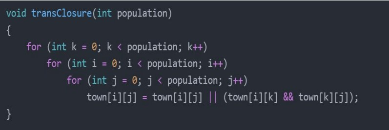
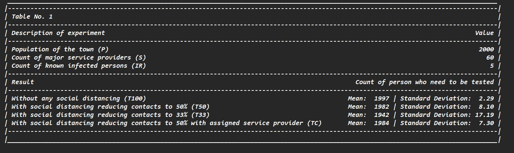
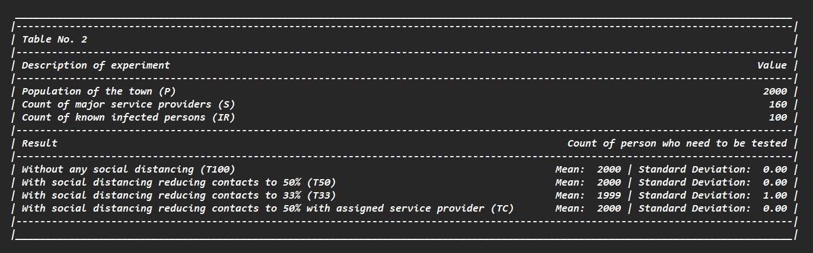
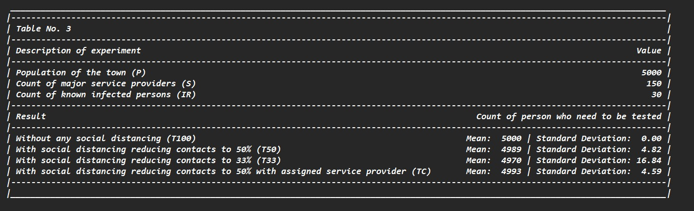
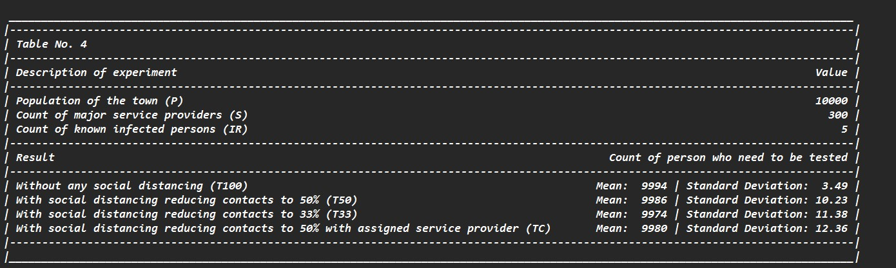

<!DOCTYPE html>
<html lang="en">
  <head>
    <meta charset="UTF-8" />
    <meta http-equiv="X-UA-Compatible" content="IE=edge" />
    <meta name="viewport" content="width=device-width, initial-scale=1.0" />
  </head>
  <body>
    <h1>Effect-OF-Social-Distancing-Using-Graph-Algorihm</h1>
    

      • Simulates the spread and extent of a disease (Covid-19) taking a virtual
      population count and their interactions and behavior into account. 
      • Shows result for any community spreadable disease given its infectivity
      rate.  • Displays the number of people infected and its
      standard deviations on the nth day of start of the pandemic in a location.
    

    
     
    <h2>Algorithm Used:</h2>
    
    
Modified Floyd Warshall for finding the Transitive Closure.

     
       <h2>Various Social Distancing Scenarios </h2>
    
   
It lists the various cases of restricted interactions among the 
    populations. These restricted cases are explained below. 

    <h3>Without any social distancing (T100) </h3>
    
It is the base case with no restrictions

    <h3>With social distancing reducing contacts to 50% (T50) </h3>
    
The person-to-person interaction is reduced to one half the level used in T100 
      experimentations. However, the interaction with the service providers remains at the level used 
      in the business as usual level. 
      You may achieve this by performing reset of certain set values in the adjacency matrix. 
      

      <h3>With social distancing reducing contacts to 33% (T33) </h3>
      
The person-to-person interaction is reduced to a third of the level used in T100 
        experimentations. However, the interaction with the service providers remains at the level used 
        in the business as usual level. 

        <h3>With social distancing reducing contacts to 50% with assigned service 
          provider (TC) </h3>
          
The person-to-person interaction is reduced to one half the level used in T100 
            experimentations. Further, the odd numbered service provider will only interact with the 
            persons with odd indices. Similarly, an even indexed person only gets service from a service 
            provider with even index.

     
    <h2>Result:</h2>
    

    
      
      
      
    

     
    <h2>Conclusion:</h2>
    
<ul>
        <li>Number of Infected persons decreases with limiting interactions.</li>
        <li>Restricting service provider doesn’t mean much until we restrict normal residents 
            to an extreme extent
            </li>
            <li>Faced challenges while deciding the various setting of the town, normal residents’ 
                interactions, service providers’ interactions in accordance with the total 
                population.Solved it by sampling different inputs and testing from multiple cases and got the 
                most suitable settings
                </li>
    </ul>

  </body>
</html>
